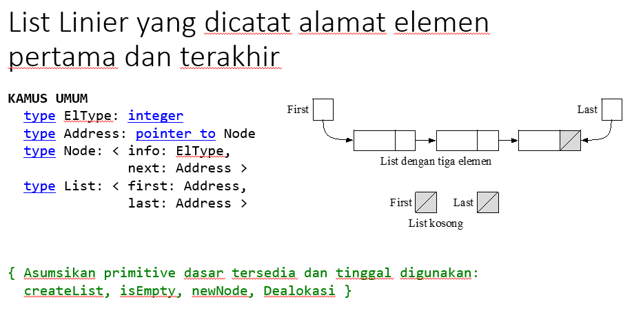

# Soal
## 1

Buatlah prosedur **insertFirst** untuk sebuah list l dengan l adalah List yang mencatat elemen pertama (First) dan elemen terakhir (Last)
```
procedure insertFirst(input/output l:List, input x:ElType)
```
List l mungkin kosong.

## 2

Buatlah prosedur **insertLast** dari sebuah list l dengan l adalah List yang mencatat elemen pertama (First) dan elemen terakhir (Last)
```
procedure insertLast(input/output l:List, input x:ElType)
```
List l mungkin kosong.

## 3

Buatlah fungsi search untuk mengetahui apakah sebuah nilai x terdapat dalam sebuah list l. l adalah List yang mencatat elemen pertama (First) dan elemen terakhir (Last) dan elemen terakhir adalah dummy.
```
function search(l:List, x:ElType) → boolean
```
List L mungkin kosong

# Solusi
## 1
```
procedure insertFirst(input/output l: List, input x: ElType)
    p <- newNode(x)
    if (isEmpty(l)) then
        l.First <- p
        l.Last <- p
    else
        p↑.next <- l.First
        l.First <- p
```
## 2
```
procedure insertLast(input/output l: List, input x: ElType)
    p <- newNode(x)
    if (isEmpty(l)) then
        l.First <- p
        l.Last <- p
    else
        l.Last↑.next <- p
        l.Last <- p
```
## 3
```
function search(l: List, x: ElType) -> boolean
    if (isEmpty(l))
        -> false
    else
        p <- l.First
        while (p != NULL) do
            if (p↑.info == x) then
                -> true
            else
                p <- p↑.next
        -> false
```