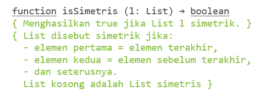
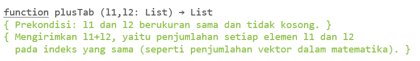
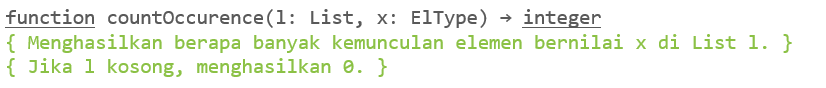
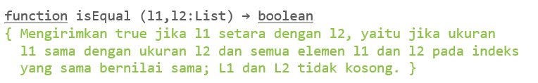
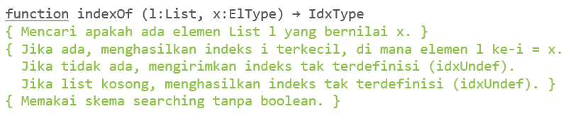
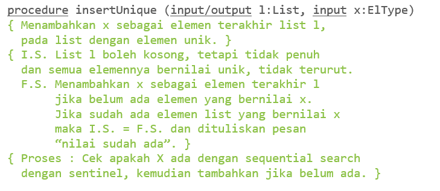
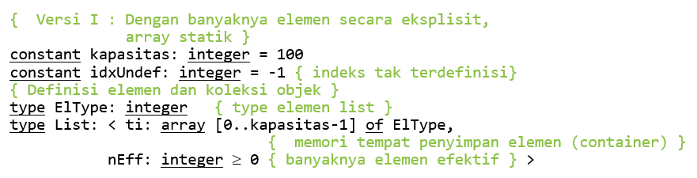
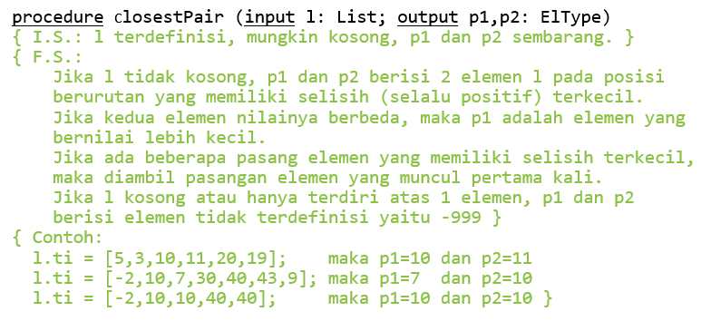
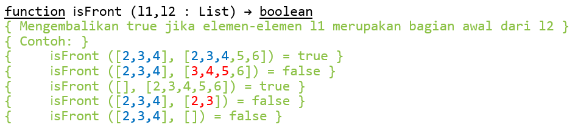

# Soal
## 1
Asumsikan bahwa sudah didefinisikan list memanfaatkan array statik yang direpresentasikan secara eksplisit dalam notasi algoritmik (alt-2a eksplisit rata kiri).​

Buatlah masing-masing fungsi/prosedur berikut ini untuk representasi struktur data array tersebut dalam notasi algoritmik.​

Gunakan sedapat mungkin primitif-primitif lain yang tersedia.​ <br> **(Soal 1 sampai 6 menggunakan asumsi yang sama)**


## 2

## 3

## 4

## 5

## 6

## 7
Jika ADT List pada soal 1 diubah menjadi representasi implisit, apa yang harus diubah dari struktur data berikut?

## 8
Buatlah fungsi getFirstIdx dan getLastIdx dalam representasi array secara **eksplisit** dan **implisit**
## 9
Kerjakan kembali fungsi-fungsi yang dikerjakan di latihan soal 1 **(nomor 1 - 6)**, tetapi untuk representasi implisit. Bagian kode mana saja yang berubah?
## 10
Buatlah fungsi/prosedur berikut untuk **ADT List** representasi dengan **array statik eksplisit**.

## 11
Buatlah fungsi/prosedur berikut untuk **ADT List** representasi dengan **array statik eksplisit**.

# Solusi
## 1
```
function isSimetris (l: List) -> boolean
{ Menghasilkan true jika list l simetrik. }

KAMUS LOKAL
    i, n: integer

ALGORITMA
    n <- l.Neff-1
    i traversal[0 .. l.Neff-1]
        if not l.content[i] = l.content[n-i-1] then
            -> false
    -> true
```
## 2
```
function plusTab (l1, l2: List) -> List
{ Prekondisi: l1 dan l2 berukuran sama dan tidak kosong. }
{ Mengirimkan l1+l2, yaitu penjumlahan setiap elemen l1 dan l2
  pada indeks yang sama (seperti penjumlahan vektor dalam matematika). }

KAMUS LOKAL
    lres: List
    i: integer

ALGORITMA
    i traversal[0 .. l1.Neff-1]
        lres.content[i] <- l1.content[i] + l2.content[i]
    lres.Neff <- l1.Neff
    -> lres
```
## 3
```
function countOccurence(l: List, x: ElType) -> integer
{ Menghasilkan berapa banyak kemunculan elemen bernilai x di List l. }
{ Jika l kosong, menghasilkan 0 }

KAMUS LOKAL
    i, count: integer

ALGORITMA
    count <- 0
    i traversal[0..l.Neff-1]
        if l.content[i] = x then
            count <- count + 1
    -> count
```
## 4
```
function isEqual (l1, l2: List) -> boolean
{ Mengirimkan true jika l1 setara dengan l2, yaitu jika ukuran
  l1 sama dengan ukuran l2 dan semua elemen l1 dan l2 pada indeks
  yang sama bernilai sama; l1 dan l2 tidak kosong. }

KAMUS LOKAL
    i: integer

ALGORITMA
    if l1.Neff = l2.Neff then
        i traversal[0 .. l1.Neff-1]
            if not l1.content[i] = l2.content[i]
                -> false
        -> true
    else
        -> false
```
## 5
```
function indexOf (l: List, x: ElType) -> IdxType
{ Mencari apakah ada elemen List l yang bernilai x. }
{ Jika ada, menghasilkan indeks i terkecil di mana elemen l ke-i = x   .
  Jika tidak ada, mengirimkan indeks tak terdefinisi (idxUndef).
  Jika list kosong, menghasilkan indeks tak terdefinisi (idxUndef). }

KAMUS LOKAL
    i: integer

ALGORITMA
    i traversal[0 .. l.Neff-1]
        if l.content[i] = x then
            -> i
    -> idxUndef
```
## 6
```
procedure insertUnique (input/output l: List, input x: ElType)
{ I.S. List l boleh kosong, tetapi tidak penuh
  dan semua elemennya bernilai unik, tidak terurut.
  F.S. Menambahkan x sebagai elemen terakhir l
       jika belum ada elemen yang bernilai x.
       Jika sudah ada elemen list yang bernilai x
       maka I.S. = F.S. dan tuliskan pesan "nilai sudah ada" }

KAMUS LOKAL
    unique: boolean
    i: integer

ALGORITMA
    unique <- true
    i <- 0
    while (unique and i < l.Neff) do
        if l.content[i] = x then
            unique = false
        i <- i+1
    if unique then
        l.content[i] = x
        l.Neff <- l.Neff + 1
    else
        output("nilai sudah ada")
```
## 7
```
{ Versi I : Dengan banyaknya elemen secara eksplisit,
            array statik }
constant kapasitas: integer = 100
constant idxUndef: integer = -1 { indeks tak terdefinisi }
constant MARK: integer = -9999
{ Definisi elemen dan koleksi objek }
type ElType: integer { type elemen list }
type List: < ti: array[0..kapasitas-1] of ElType >
```
Struktur data perlu diubah dengan menambahkan variabel MARK dan menghapus variabel nEff dalam type List
## 8
```
function getFirstIdx(l: List) -> IdxType
{ Mengembalikan indeks pertama dari sebuah array eksplisit }

KAMUS LOKAL
ALGORITMA
    -> 0

function getLastIdx(l: List) -> IdxType
{ Mengembalikan indeks terakhir dari sebuah array eksplisit }

KAMUS LOKAL
ALGORITMA
    -> l.Neff-1
```
```
function getFirstIdx(l: List) -> IdxType
{ Mengembalikan indeks pertama dari sebuah array implisit }

KAMUS LOKAL
ALGORITMA
    -> 0

function getLastIdx(l: List) -> IdxType
{ Mengembalikan indeks terakhir dari sebuah array implisit }

KAMUS LOKAL
    i: integer

ALGORITMA
    i <- 0
    while(l.content[i] != MARK) do
        i <- i+1
    -> i-1
```
## 9
```
function isSimetris (l: List) -> boolean
{ Menghasilkan true jika list l simetrik. }

KAMUS LOKAL
    i, n: integer

ALGORITMA
    n <- 0
    while (l.content[n] != MARK) do
        n <- n+1
    i traversal[0 .. n-1]
        if not l.content[i] = l.content[n-i-1] then
            -> false
    -> true 
```
```

function plusTab (l1, l2: List) -> List
{ Prekondisi: l1 dan l2 berukuran sama dan tidak kosong. }
{ Mengirimkan l1+l2, yaitu penjumlahan setiap elemen l1 dan l2
  pada indeks yang sama (seperti penjumlahan vektor dalam matematika). }

KAMUS LOKAL
    lres: List
    i: integer

ALGORITMA
    i <- 0
    while (l1.content[i] != MARK) do
        lres.content[i] <- l1.content[i] + l2.content[i]
        i <- i+1
    -> lres 
```
```
function countOccurence(l: List, x: ElType) -> integer
{ Menghasilkan berapa banyak kemunculan elemen bernilai x di List l. }
{ Jika l kosong, menghasilkan 0 }

KAMUS LOKAL
    i, count: integer

ALGORITMA
    count <- 0
    i <- 0
    while (l1.content[i] != MARK) do
        if l.content[i] = x then
            count <- count + 1
        i <- i+1
    -> count 
```
```
function isEqual (l1, l2: List) -> boolean
{ Mengirimkan true jika l1 setara dengan l2, yaitu jika ukuran
  l1 sama dengan ukuran l2 dan semua elemen l1 dan l2 pada indeks
  yang sama bernilai sama; l1 dan l2 tidak kosong. }

KAMUS LOKAL
    i: integer

ALGORITMA
    i <- 0
    while (l1.content[i] != MARK and l2.content[i] != MARK) do
        if(l1.content[i] != l2.content[i]) then
            -> false
        i <- i+1
    if (l1.content[i] = MARK and l2.content[i] = MARK) then
        -> true
    else
        -> false 
```
```
function indexOf (l: List, x: ElType) -> IdxType
{ Mencari apakah ada elemen List l yang bernilai x. }
{ Jika ada, menghasilkan indeks i terkecil di mana elemen l ke-i = x   .
  Jika tidak ada, mengirimkan indeks tak terdefinisi (idxUndef).
  Jika list kosong, menghasilkan indeks tak terdefinisi (idxUndef). }

KAMUS LOKAL
    i: integer

ALGORITMA
    i <- 0
    while (l1.content[i] != MARK) do
        if l.content[i] = x then
            -> i
        i <- i+1
    -> idxUndef 
```
```
procedure insertUnique (input/output l: List, input x: ElType)
{ I.S. List l boleh kosong, tetapi tidak penuh
  dan semua elemennya bernilai unik, tidak terurut.
  F.S. Menambahkan x sebagai elemen terakhir l
       jika belum ada elemen yang bernilai x.
       ------------------------------------------
       Jika sudah ada elemen list yang bernilai x
       maka I.S. = F.S. dan tuliskan pesan "nilai sudah ada" }

KAMUS LOKAL
    unique: boolean
    i: integer

ALGORITMA
    unique <- true
    i <- 0
    while (l1.content[i] != MARK and unique) do
        if l.content[i] = x then
            unique = false
        i <- i+1
    if unique then
        l.content[i] = x
    else
        output("nilai sudah ada")
```
## 10
```
procedure closestPair (input l: List; output p1, p2: ElType) 
{ I.S.: l terdefinisi, mungkin kosong, p1 dan p2 sembarang. } 
{ F.S.: 
    Jika l tidak kosong, p1 dan p2 berisi 2 elemen l pada posisi 
    berurutan yang memiliki selisih terkecil dengan p1 sebagai 
    nilai yang lebih kecil. 
    Jika l kosong atau hanya terdiri atas 1 elemen, p1 dan p2 
    berisi elemen tidak terdefinisi yaitu -999 } 

KAMUS LOKAL 
    i, mindiff, a, b: integer 

ALGORITMA 
    p1, p2 <- -999 
    i traversal[1 .. l.Neff - 1] 
        a <- l.content[i - 1] 
        b <- l.content[i] 
        if a > b then 
            a <- l.content[i] 
            b <- l.content[i - 1] 
        if i = 1 then 
            p1 <- a 
            p2 <- b 
            mindiff <- b-a 
        else { i > 1 } 
            if mindiff > (b - a) then 
                p1 <- a 
                p2 <- b 
                mindiff <- b-a
```
## 11
```
function isFront (l1, l2 : List) -> boolean
{ Mengembalikan true jika l1 merupakan bagian awal dari l2 }

KAMUS LOKAL
    i: integer

ALGORITMA
    i traversal [0 .. l1.Neff - 1]
        if l1.content[i] != l2.content[i] then
            -> false
    -> true
```