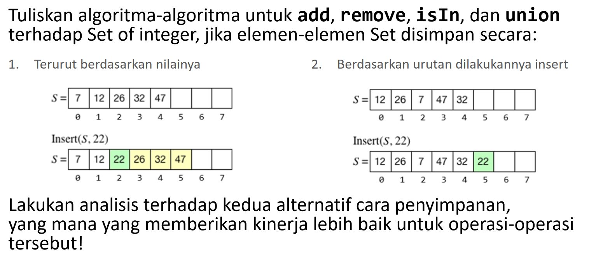
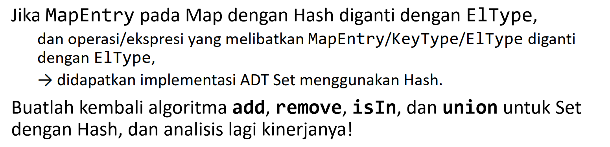

# Soal
## 1

## 2

# Solusi
## 1
### Terurut Berdasarkan Nilai
```
procedure add (input/output s: Set, input x: ElType)
{ I.S. Set s boleh kosong, tetapi tidak penuh
       terurut berdasarkan nilai.
  F.S. Menambahkan x mengikuti urutan nilai
       jika belum ada elemen yang bernilai x.
       ------------------------------------------
       Jika sudah ada elemen set yang bernilai x
       maka I.S. = F.S. }

KAMUS LOKAL
    temp: ElType
    i: integer
    unique: boolean

ALGORITMA
    unique <- true
    i <- 0
    while (unique and i < s.length and s.buffer[i] <= x) do
        if s.buffer[i] = x then
            unique <- false
        i <- i+1
    if unique then
        while i <= s.length do
            { melakukan penyisipan elemen unik ke dalam set }
            temp <- s.buffer[i]
            s.buffer[i] <- x
            x <- temp
            i <- i + 1
        s.length <- s.length + 1
```
```
procedure remove (input/output s: Set, input x: ElType)
{ I.S. Set s tidak kosong, nilainya terurut
  F.S. Set s tanpa elemen x }

KAMUS LOKAL
    i: integer
    found: boolean

ALGORITMA
    found <- false
    i <- 0
    while (not found and i < s.length and s.buffer[i] <= x) do
        if s.buffer[i] = x then
            found <- true
        else
            i <- i+1
    if found then
        while i < s.length do
            { menghapus elemen dan menggeser semua elemen setelahnya }
            s.buffer[i] <- s.buffer[i+1]
            i <- i + 1
        s.length <- s.length - 1
```
```
function isIn (x: ElType, s: Set) -> boolean
{ Mengembalikan true jika set S memiliki elemen x }

KAMUS LOKAL
    found: boolean
    i: integer
ALGORITMA
    found <- false
    i <- 0
    while (not found and i < s.length and s.buffer[i] <= x) do
        if s.buffer[i] = x then
            found <- true
        else
            i <- i+1
    -> found
```
```
function union (s: Set, t: Set) -> Set
{ Mengembalikan sebuah set yang merupakan gabungan dari dua set }

KAMUS LOKAL
    result: Set
    i, j: integer

ALGORITMA
    i traversal [0 .. s.length[i] - 1]
        insert(result, s.buffer[i])
    j traversal [0 .. t.length[j] - 1]
        insert(result, t.buffer[j])
    { dapat dipastikan prosedur insert akan
      memasukkan elemen mengikuti urutan nilai }
```

### Tidak Terurut Berdasarkan Nilai
```
procedure add (input/output s: Set, input x: ElType)
{ I.S. Set s boleh kosong, tetapi tidak penuh
       tidak terurut berdasarkan nilai.
  F.S. Menambahkan x di akhir indeks set
       jika belum ada elemen yang bernilai x.
       ------------------------------------------
       Jika sudah ada elemen set yang bernilai x
       maka I.S. = F.S. }

KAMUS LOKAL
    i: integer
    unique: boolean

ALGORITMA
    unique <- true
    i <- 0
    while (unique and i < s.length) do
        if s.buffer[i] = x then
            unique <- false
        i <- i+1
    if unique then
        s.length <- s.length + 1
        s.buffer[s.length - 1] <- x
```
```
procedure remove (input/output s: Set, input x: ElType)
{ I.S. Set s tidak kosong, nilainya tidak terurut
  F.S. Set s tanpa elemen x }

KAMUS LOKAL
    i: integer
    found: boolean

ALGORITMA
    found <- false
    i <- 0
    while (not found and i < s.length and s.buffer[i] <= x) do
        if s.buffer[i] = x then
            found <- true
        else
            i <- i+1
    if found then
        while i < s.length do
            { menghapus elemen dan menggeser semua elemen setelahnya }
            s.buffer[i] <- s.buffer[i+1]
            i <- i + 1
        s.length <- s.length - 1
```
```
function isIn (x: ElType, s: Set) -> boolean
{ Mengembalikan true jika set S memiliki elemen x }

KAMUS LOKAL
    found: boolean
    i: integer
ALGORITMA
    found <- false
    i <- 0
    while (not found and i < s.length) do
        if s.buffer[i] = x then
            found <- true
        else
            i <- i+1
    -> found
```
```
function union (s: Set, t: Set) -> Set
{ Mengembalikan sebuah set yang merupakan gabungan dari dua set }

KAMUS LOKAL
    result: Set
    i, j: integer

ALGORITMA
    i traversal [0 .. s.length[i] - 1]
        insert(result, s.buffer[i])
    j traversal [0 .. t.length[j] - 1]
        insert(result, t.buffer[j])
```
<p align="justify">
Algoritma dapat berjalan dengan lebih baik apabila set diurutkan berdasarkan nilai karena pencarian nilai yang unik dapat dilakukan menggunakan metode binary search dan bukan hanya sequential search
<p>

## 2
```
procedure add (input/output s: Set, input x: ElType)
{ I.S. Set s boleh kosong, tetapi tidak penuh
  F.S. Menambahkan x
       jika belum ada elemen yang bernilai x.
       ------------------------------------------
       Jika sudah ada elemen set yang bernilai x
       maka I.S. = F.S. }

KAMUS LOKAL
    idx: integer
    unique: boolean

ALGORITMA
    unique <- true
    idx <- hash(x)
    while (unique and s.buffer[idx] != NIL) do
        if s.buffer[idx] = x then
            unique <- false
        else
            idx <- idx+1
    if unique then
        s.buffer[idx] <- x
```
```
procedure remove (input/output s: Set, input x: ElType)
{ I.S. Set s tidak kosong, nilainya terurut
  F.S. Set s tanpa elemen x }

KAMUS LOKAL
    idx: integer
    found: boolean

ALGORITMA
    found <- false
    idx <- hash(x)
    while (not found and s.buffer[idx] != NIL) do
        if s.buffer[idx] = x then
            found <- true
        else
            idx <- idx+1
    if found then
        s.buffer[idx] <- NIL
```
```
function isIn (x: ElType, s: Set) -> boolean
{ Mengembalikan true jika set S memiliki elemen x }

KAMUS LOKAL
    found: boolean
    idx: integer
ALGORITMA
    found <- false
    idx <- hash(x)
    while (not found and s.buffer[idx] != NIL) do
        if s.buffer[idx] = x then
            found <- true
        else
            idx <- idx+1
    -> found
```
```
function union (s: Set, t: Set) -> Set
{ Mengembalikan sebuah set yang merupakan gabungan dari dua set }

KAMUS LOKAL
    result: Set
    i, j: integer

ALGORITMA
    i traversal [0 .. s.length[i] - 1]
        add(result, s.buffer[i])
    j traversal [0 .. t.length[j] - 1]
        add(result, t.buffer[j])
    -> result
    { prosedur add sudah memastikan jika
     elemen unik atau tidak }
```