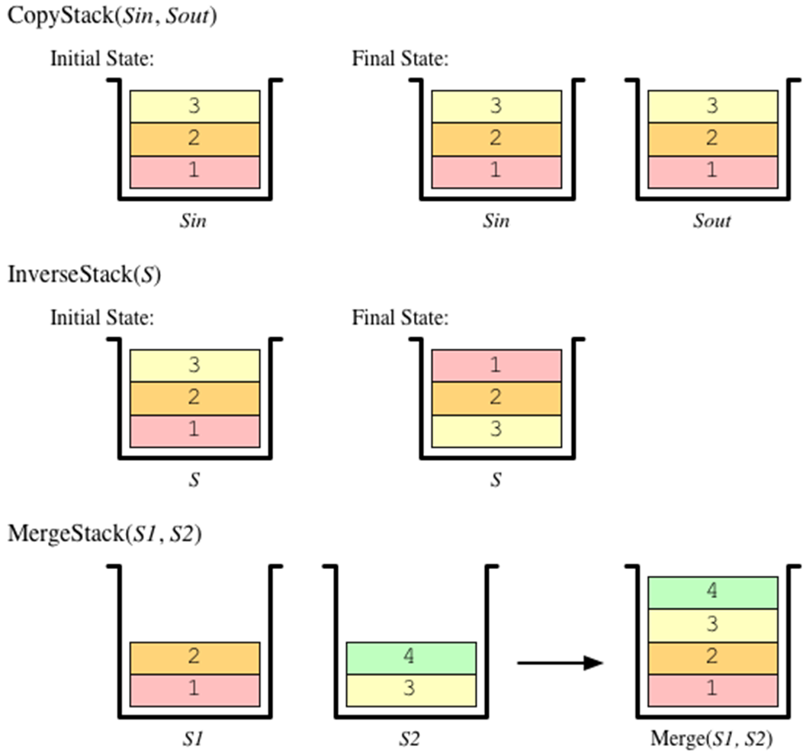

# Soal
## 1
<p align="justify">
Dengan menggunakan ADT Stack yang direpresentasikan sebagai array statik-eksplisit seperti yang dibahas di materi kuliah, realisasikan prosedur dan fungsi berikut ini:

```
procedure copyStack(input sIn: Stack, output sOut: Stack)
{ Membuat salinan sOut }
{ I.S. sIn terdefinisi, sOut sembarang }
{ F.S. sOut berisi salinan sIn yang identik }
```
</p>

<div style="background-color: white; display: inline-block; padding: 10px;">
  
</div>

## 2
<p align="justify">
Dengan menggunakan ADT Stack yang direpresentasikan sebagai array statik-eksplisit seperti yang dibahas di materi kuliah, realisasikan prosedur dan fungsi berikut ini:
</p>

```
procedure inverseStack(input/output s: Stack)
{ Membalik isi suatu stack }
{ I.S. s terdefinisi }
{ F.S. Isi s terbalik dari posisi semula }
```

## 3
<p align="justify">
Dengan menggunakan ADT Stack yang direpresentasikan sebagai array statik-eksplisit seperti yang dibahas di materi kuliah, realisasikan prosedur dan fungsi berikut ini.

```
function mergeStack(s1,s2: Stack) → Stack
{ Menghasilkan sebuah stack yang merupakan hasil penggabungan s1
  dengan s2 dengan s1 berada di posisi lebih “bawah”. Urutan kedua
  stack harus sama seperti aslinya. }
{ Stack baru diisi sampai seluruh elemen s1 dan s2 masuk ke dalam
  stack, atau jika stack baru sudah penuh, maka elemen yang
  dimasukkan adalah secukupnya yang dapat ditampung. }
```
</p>

# Solusi
## 1
```
procedure copyStack(input sIn: Stack, output sOut: Stack)
{ Membuat salinan sOut }
{ I.S. sIn terdefinisi, sOut sembarang }
{ F.S. sOut berisi salinan sIn yang identik }

KAMUS LOKAL
    Temp: Stack
    i: integer
ALGORITMA
    i traversal [0 .. length(sIn)]
        push(Temp, top(sIn))
        pop(sIn)
    i traversal [0 .. length(Temp)]
        push(sOut, top(Temp))
        push(sIn, top(Temp))
        pop(Temp)
```

## 2
```
procedure inverseStack(input/output s: Stack)
{ Membalik isi suatu stack }
{ I.S. s terdefinisi }
{ F.S. Isi s terbalik dari posisi semula }

KAMUS
    i : integer
    v : ElType
    Temp : Stack

ALGORITMA
    CreateStack(sOut)
    copyStack(sIn, Temp)
    i traversal [0 .. length(Temp)]
        pop(Temp,v)
        push(sOut, v)
```

## 3
```
function mergeStack(s1,s2: Stack) → Stack
{
    Menghasilkan sebuah stack yang merupakan hasil penggabungan s1
    dengan s2 dengan s1 berada di posisi lebih “bawah”. Urutan kedua
    stack harus sama seperti aslinya.
}

{
    Stack baru diisi sampai seluruh elemen s1 dan s2 masuk ke dalam
    stack, atau jika stack baru sudah penuh, maka elemen yang
    dimasukkan adalah secukupnya yang dapat ditampung.
}

KAMUS
    v : ElType
    Temp1 : Stack
    Temp2 : Stack

ALGORITMA
    CreateStack(Temp1)
    CreateStack(Temp2)
    inverseStack(s2,Temp2)
    copyStack(s1,Temp1)
    i traversal [0 .. length(Temp2)]
        pop(Temp2,v)
        push(Temp1, v)
    --> Temp1 
```