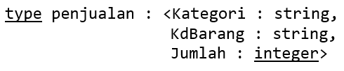
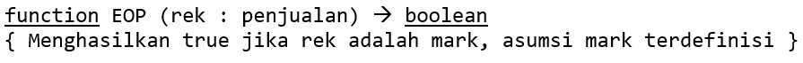
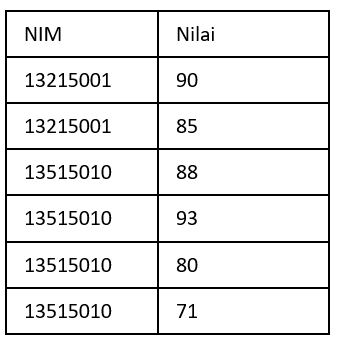

# Soal
## 1 
<p align="justify">
Buatlah program dalam notasi algoritmik yang membaca file sekuensial rekaman.dat berisi data bertipe <strong>rekamanMHS</strong> sbb:

```
type rekamanMHS : < NIM : string, nilai : integer >
```

Selanjutnya, tuliskan ke file sekuensial lain <i>rekaman1.dat</i> dengan spesifikasi hanya menulis rekaman yang berisi komponen nilai >= 80. 

File sekuensial diakhiri mark berupa : NIM = “99999999” dan nilai = 999. 
</p>

## 2
<p align="justify">
Buatlah program dalam notasi algoritmik yang membaca file sekuensial <i>rekaman.dat</i> yang berisi data bertipe <strong>rekamanMHS</strong> (spt. pada Soal 1) 

Selanjutkan, tuliskan hanya bagian nilai-nya saja ke file sekuensial <i>nilai.dat</i> lain (berisi data bertipe integer).

File <i>nilai.dat</i> diakhiri mark, yaitu nilai 999.

</p>

## 3
<p align="justify">
Diketahui file <i>datapenjualan.dat</i> yang berisi data bertipe penjualan sbb.



Data pada file terurut berdasarkan Kategori.<br>
Buatlah program dalam notasi algoritmik untuk mendapatkan total barang terjual per Kategori. Gunakan skema konsolidasi tanpa separator. <br>
Asumsikan terdefinisi sebuah function bernama EOP untuk memeriksa apakah rekaman adalah mark atau bukan.



</p>

## 4
<p align="justify">
Diketahui 2 buah file data mahasiswa misalnya <i>rekmhs1.dat</i> dan <i>rekmhs2.dat</i> yang menyimpan data bertipe <i>rekamanMHS</i> (spt. pada Soal 1, namun type data NIM diubah menjadi integer). 

Data pada kedua file terurut menurut NIM.

Tuliskan hasil penggabungan kedua file ke dalam sebuah file bernama <i>rekmhs.dat.</i>

Gunakan skema merging versi AND.
</p>

## 5
<p align="justify">
Diketahui data array of nilaiMhs dengan nilaiMhs adalah type bentukan sbb. (array terurut berdasakan NIM):

```
type nilaiMhs : <NIM:string, Nilai:integer>
```

Dengan memanfaatkan ide skema konsolidasi, tuliskan daftar NIM dan nilai rata-rata untuk semua nilainya. Apa yang menjadi **mark**?

Sebagai contoh array:



berdasarkan array di atas akan tercetak: <br>
13215001 88 <br>
13515010 83
</p>


# Solusi
## 1
```
Program BacaFile
{ Membaca file sekuensial rekaman.dat berisi data bertipe rekamanMHS, kemudian tuliskan ke file sekuensial lain rekaman1.dat dengan spesifikasi hanya menulis rekaman yang berisi komponen nilai >= 80. File sekuensial diakhiri mark berupa : NIM = “99999999” dan nilai = 999. }

KAMUS
    type rekamanMHS : < NIM : string, nilai : integer >
    ArsipMHS : SEQFILE of
               (*) rekamanMHS
               (1) <"99999999", 999>
    ArsipMHS1 : SEQFILE of
                (*) rekamanMHS
                (1) <"99999999", 999>
    reksaatini : rekamanMHS

ALGORITMA
    assign(ArsipMHS, "rekaman.dat")
    assign(ArsipMHS1, "rekaman1.dat")
    open(ArsipMHS, reksaatini)
    rewrite(ArsipMHS1)
    while reksaatini.NIM != "99999999" or reksaatini.nilai != 999 do
        if reksaatini.nilai >= 80 then
             write(ArsipMHS1, reksaatini)
        read(ArsipMHS, reksaatini)
    { EOP : reksaatini.NIM = "99999999" and reksaatini.nilai = 999 }
    write(ArsipMHS1, reksaatini)
    close(ArsipMHS)
    close(ArsipMHS1)
```
## 2
```
Program NilaiMahasiswa
{ membaca file sekuensial rekaman.dat yang berisi data bertipe rekamanMHS, kemudian menuliskan hanya bagian nilai-nya saja ke file sekuensial nilai.dat (berisi data bertipe integer) diakhiri dengan mark, yaitu nilai 999. }

KAMUS
    type rekamanMHS : < NIM : string, nilai : integer >
    ArsipMHS : SEQFILE of
               (*) rekamanMHS
               (1) <"99999999", 999>
    nilaiMHS : SEQFILE of
                (*) integer
                (1) 999
    reksaatini : rekamanMHS
    nilaisaatini : integer

ALGORITMA
    assign(ArsipMHS, "rekaman.dat")
    assign(nilaiMHS, "nilai.dat")
    open(ArsipMHS, reksaatini)
    rewrite(nilaiMHS)
    while reksaatini.NIM != "99999999" or reksaatini.nilai != 999 do
        write(nilaiMHS, reksaatini.nilai)
        read(ArsipMHS, reksaatini)
    { EOP : reksaatini.NIM = "99999999" and reksaatini.nilai = 999 }
    write(reksaatini.nilai, nilaiMHS)
    close(ArsipMHS)
    close(nilaiMHS)
```

## 3
```
Program TotalPenjualan
{ Menerima file datapenjualan.dat yang terurut berdasarkan kategori kemudian mengeluarkan total barang terjual per kategori }

KAMUS
    type penjualan : <Kategori : string,
                      KdBarang : string,
                      Jumlah : integer>
    function EOP (rek : penjualan) -> boolean
    dataterjual : SEQFILE of
                  (*) penjualan
                  (1) mark
    barang : penjualan
    jumlah : integer
    kategorisaatini : string

ALGORITMA
    assign(dataterjual, "datapenjualan.dat")
    open(dataterjual, barang)
    jumlah <- 0
    while not EOP(barang) do
        jumlah <- jumlah + barang.Jumlah
        kategorisaatini <- barang.Kategori
        read(dataterjual, barang)
        if kategorisaatini != barang.Kategori then
            output(kategorisaatini, " - ", jumlah)
            jumlah <- 0
    { EOP : barang = mark }
    close(dataterjual)
```

## 4
```
Program MergeData
{ Menerima 2 buah file data mahasiswa yang menyimpan data bertipe rekamanMHS kemudian menggabungkan keduanya ke dalam file rekmhs.dat }

KAMUS
    type rekamanMHS : < NIM : integer, nilai : integer >
    rek1 : SEQFILE of
              (*) rekamanMHS
              (1) <99999999, 999>
    rek2 : SEQFILE of
              (*) rekamanMHS
              (1) <99999999, 999>
    rekmerged : SEQFILE of
                   (*) rekamanMHS
                   (1) <99999999, 999>
    rek1, rek2 : rekamanMHS
    constant mark : rekamanMHS = <“99999999”, 999>

ALGORITMA
    assign(rek1, "rekmhs1.dat")
    assign(rek2, "rekmhs2.dat")
    open(rek1, rek1)
    open(rek2, rek2)
    assign(rekmerged, "rekmhs.dat")
    rewrite(rekmerged)
    while (rek1 != mark and rek2 != mark) do
        if rek1.NIM <= rek2.NIM then
            write(rekmerged, rek1)
            read(rek1, rek1)
        else { rek1.NIM > rek2.NIM }
            write(rekmerged, rek2)
            read(rek2, rek2)
    { rek1 = mark or rek2 = mark }
   
    while (rek1 != mark) do
            write(rekmerged, rek1)
            read(rek1, rek1)
    while (rek2 != mark) do
            write(rekmerged, rek2)
            read(rek2, rek2)

    write(rekmerged, mark)
    close(rek1)
    close(rek2)
    close(rekmerged)
```

## 5
```
procedure RataNilai (input T: array[1..NMax] of nilaiMHS, N: Neff)
{ Menerima array nilaiMHS kemudian mencetak nilai rata-rata tiap NIM }

KAMUS
    jumlahnilai : integer
    matkul : integer
    i : integer
    rerata : real

ALGORITMA
    jumlahnilai <- 0
    matkul <- 0
    if Neff < 1 then
        output("Tabel kosong!")
    else
        i traversal [1..Neff - 1]
            jumlahnilai <- jumlahnilai + Ti.nilai
            matkul <- matkul + 1
            if Ti.NIM != Ti+1.NIM then
                rerata <- jumlahnilai / matkul
                output(Ti.NIM, " ", rerata)
                jumlahnilai <- 0
                matkul <- 0
        jumlahnilai <- jumlahnilai + TNeff.nilai
        matkul <- matkul + 1
        rerata <- jumlahnilai / matkul
        output(TNeff.NIM, " ", rerata)
```