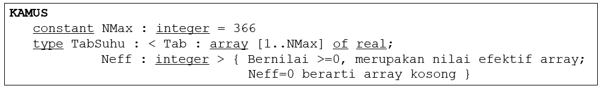
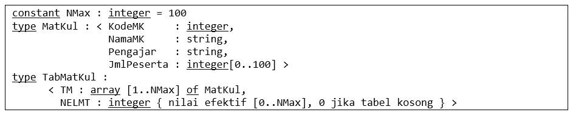
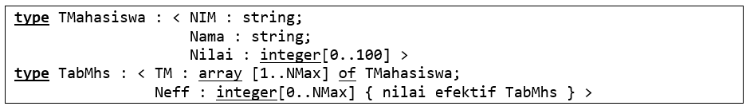
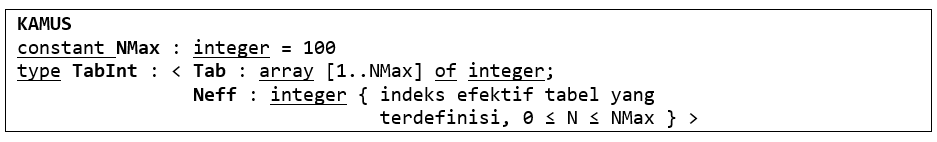

# Soal
## 1 
<p align="justify">
Diketahui kamus data dalam sebuah program sebagai berikut:



Tabel TabSuhu digunakan untuk menyimpan data suhu dalam 1 tahun. Setiap elemen TabSuhu.Tab menyimpan data pada satu hari. Neff menyatakan banyaknya hari dari data suhu yang disimpan. 

Buatlah function **SearchGtX** yang menerima masukan sebuah TabSuhu misalnya T yang mungkin kosong (Neff = 0) dan sebuah nilai suhu misalnya X dan menghasilkan true jika ada data di T yang bernilai > X (false jika tidak).
</p>

## 2
<p align="justify">
Diberikan definisi suatu tabel daftar mata kuliah sebagai berikut (nama-nama diasumsikan dapat dipahami dengan jelas):



Buatlah fungsi **IdxPengajarMK** yang menerima masukan berupa nama pengajar, misalnya P, dan sebuah TabMatKul, misalnya T, dan menghasilkan indeks di mana P ditemukan terakhir kali di T, atau 0 jika P tidak ditemukan di T. T mungkin kosong.
</p>

## 3
<p align="justify">
Diberikan definisi berikut ini.



### a.
Buatlah prosedur berikut: 
```
procedure UrutTabMhs (input/output TMhs : TabMhs)
```
yang digunakan untuk mengurutkan elemen TMhs secara terurut mengecil pada atribut Nilai. Pengurutan dilakukan dengan pendekatan seleksi.

### b.
Bisakah soal di atas diselesaikan dengan menggunakan pendekatan pencacah (counting sort)? Jelaskan jawaban anda.
</p>

## 4
<p align="justify">
Menggunakan definisi TabInt sebagai berikut:



buatlah procedure InputTerurut dengan definisi sebagai berikut.
```
procedure InputTerurut (input/output T : TabInt; input X : integer)
```
yang digunakan untuk memasukkan X ke dalam T. T harus selalu dalam kondisi terurut membesar (sebelum dan sesudah pemasukan elemen X). N menyimpan indeks efektif T.
</p>

# Solusi
## 1
```
function SearchGtX(T: TabSuhu, X: real) -> boolean
{ Menerima masukan tabel T dan nilai X, mengembalikan true jika nilai X ada di T }

KAMUS LOKAL
     found: boolean
     i: integer
ALGORITMA
     found <- false
     i <- 1
     while (i <= T.Neff) do
          if (T.Tabi > X) then
               -> true
          i <- i + 1
     -> false
```
## 2
```
function IdxPengajarMK(T: TabMatKul, P: string) -> integer
{ Menerima masukan nama pengajar P dan tabel T, menghasilkan indeks di mana P ditemukan terakhir kali di T }

KAMUS LOKAL
     iP, i: integer
ALGORITMA
     i <- T.NELMT
     iP <- 0
     while (i >= 1) do
          if (P = T.TMi.Pengajar) then
               iP <- i
               -> iP
          i <- i - 1
     -> iP
```

## 3
### 3a.
```
procedure UrutTabMhs (input/output TMhs : TabMhs)
{ Mengurutkan tabel nilai mahasiswa menggunakan algoritma selection sort }
{ I.S. TabMhs tidak terurut }
{ F.S. TabMhs terurut dari nilai terbesar }

KAMUS LOKAL
     i, j, imax: integer
     temp: TMahasiswa
ALGORITMA
     i <- 1
     while (i <= TMhs.Neff) do
          imax <- i
          j traversal [i..TMhs.Neff]
               if (TMhs.TMj.Nilai > TMhs.TMimax.Nilai) then
                    imax <- i
          temp <- TMhs.TMi
          TMhs.TMi <- TMhs.TMimax
          TMhs.TMimax <- temp
          i <- i + 1
```

### 3b.

<p align="justify">
Apabila algoritma yang digunakan hanyalah pendekatan pencacah tanpa modifikasi ataupun algoritma lain, maka soal di atas tidak akan bisa diselesaikan karena nama serta NIM mahasiswa yang memiliki nilai tertentu juga perlu diurutkan secara bersamaan. Counting sort secara murni tidak akan menyimpan indeks dari nilai-nilai di dalam tabel sehingga nama dan NIM mahasiswa tidak akan ikut terurut.
</p>

## 4
```
procedure InputTerurut (input/output T: TabInt; input X: integer)
{ Memasukkan input X ke dalam tabel T dengan tetap menjaga T terurut membesar }

KAMUS LOKAL
     i, j, N: integer
     found: boolean
ALGORITMA
     if (T.Neff = NMax) then
          output("Tabel sudah penuh!")
     else
          i <- 1
          while (X < T.Tabi) do
               i <- i + 1
          j traversal [T.Neff..i]
               T.Tab[j+1] <- T.Tabj
          T.Tabi <- X
```