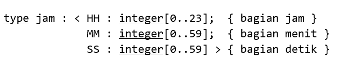

# Soal
## 1 
<p align="justify">
Buatlah program dalam notasi algoritmik, untuk membaca sejumlah nilai UTS mahasiswa di suatu kelas. Nilai UTS yang valid adalah 0..100. Pembacaan dihentikan jika masukan nilai UTS di luar range nilai yang diizinkan

Di akhir program dihitung dan ditampilkan rata-rata nilai UTS seluruh mahasiswa di kelas.

Jika tidak ada nilai UTS yang dimasukkan, tuliskan “Tidak ada data”

Contoh masukan dan keluaran:

Catatan: yang dicetak tebal adalah masukan pengguna

**Contoh 1** <br>
Nilai UTS = **50** <br>
Nilai UTS = **100** <br>
Nilai UTS = **9999** <br>
<u>Nilai rata-rata UTS = 75</u>

**Contoh 2** <br>
Nilai UTS = **101** <br>
<u>Tidak ada data</u>

</p>

## 2
<p align="justify">
Buatlah program dalam notasi algoritmik yang menerima 3 buah bilangan integer yaitu h, m, dan s yang akan digunakan untuk membentuk data bertype jam. Definisi type jam adalah sbb.



Jika ketiga input tidak valid, dituliskan pesan kesalahan ke layar “Tidak dapat membentuk jam” dan pemasukan data h, m, s diulangi sampai didapatkan nilai yang valid.

Jika ketiga input valid, maka sebuah variabel J bertype jam akan terbentu (didefinisikan nilainya) dengan J.HH bernilai h, J.MM bernilai m,  J.SS bernilai s.

Nilai valid didefinisikan sebagai: 0 ≤ h ≤ 23; 0 ≤ m ≤ 59; 0 ≤ s ≤ 59
</p>

## 3
<p align="justify">
Buatlah program dalam notasi algoritmik, untuk membaca nilai UTS dan nilai UAS mahasiswa untuk setiap pelajaran yang diikutinya (0..100) <strong>dan diakhiri jika nilai masukan UTS di luar range nilai yang diizinkan</strong>, kemudian menghitung dan mencetak rata-rata nilai akhir dari seluruh pelajaran.

Gunakan skema validasi data untuk memastikan nilai UAS pada range 0..100 (jika data tidak memenuhi syarat, read data UAS diulang). Nilai akhir untuk suatu pelajaran dihitung dari rumus (40% * nilai UTS) + (60% * nilai UAS).

Contoh masukan dan keluaran (yang dicetak tebal adalah masukan pengguna):

 

**Contoh 1** <br>
Nilai UTS = **50** <br>
Nilai UAS = **200** <br>
<u>Ulangi input nilai (0..100)!</u> <br>
Nilai UAS = **100** <br>
Nilai akhir pelajaran 1 = **80** <br>
Nilai UTS = **100** <br>
Nilai UAS = **50** <br>
Nilai Akhir pelajaran 2 = **70** <br>
Nilai UTS = **9999** <br>
<u>Nilai rata-rata dari 2 pelajaran adalah = 75</u>

 
**Contoh 2** <br>
Nilai UTS = **101** <br>
<u>Data kosong, tidak ada nilai rata-rata!</u>
</p>

# Solusi
## 1
```
Program Rata-Rata UTS
{ Menerima masukan pengguna berupa nilai UTS integer dalam interval 0..100 secara terus-menerus hingga pengguna memasukkan nilai yang tidak valid }

KAMUS
	x : integer
	i : integer
	jumlah : integer
	ratarata : real
   
ALGORITMA
	input(x)
	if x < 0 or x > 100 then
		output("Tidak ada data")
	else { x > 0 and x < 100 }
		i <- 0
		jumlah <- 0
		repeat
			i <- i + 1
			jumlah <- jumlah + x
			input(x)
		until (x < 0 or x > 100)
		ratarata <- jumlah / i
		output(ratarata)
```
## 2
```
Program Data Jam
{ Menerima masukan pengguna berupa jam menit dan detik dan memvalidasinya sebelum membentuk data bertype jam }

KAMUS
	type jam : < HH : integer[0..23]; { bagian jam }
	             MM : integer[0..59]; { bagian menit }
	             SS : integer[0..59] > { bagian detik }
	J : jam
	h, m, s : integer

ALGORITMA
	input(h, m, s)
	while ( h < 0 or h > 23 or m < 0 or m > 59 or s < 0 or s > 59 ) do
		output("Tidak dapat membentuk jam")
		input(h, m, s)
	J.HH <- h
	J.MM <- m
	J.SS <- s
```

## 3
```
Program Rata-Rata Nilai Akhir
{ Menerima masukan berupa nilai UTS dan UAS terus menerus sampai masukan nilai UTS tidak valid kemudian menentukan rata-rata nilai akhirnya}

KAMUS
	x : integer { nilai UTS yang dimasukkan }
	y : integer { nilai UAS yang dimasukkan }
	i : integer { jumlah banyaknya nilai akhir }
	nilaiakhir : real
	jumlahnilai : real
	ratarata : real

ALGORITMA
	input(x)
	if (x < 0 or x > 100 ) then
		output("Data kosong, tidak ada nilai rata-rata!")
	else
		i <- 0; jumlahnilai <- 0
		repeat
			input(y)
			while (y < 0 or y > 100) do
				output("Ulangi input nilai (0..100)!")
				input(y)
			i <- i + 1
			nilai akhir <- 0.4*UTS + 0.6*UAS
			output("Nilai akhir pelajaran ", i, " = ", nilaiakhir)
			jumlahnilai <- jumlahnilai + nilaiakhir
			input(x)
		until (x < 0 or x > 100)
		ratarata <- jumlahnilai / i
		output("Nilai rata-rata dari ", i, " pelajaran adalah = ", ratarata)
```