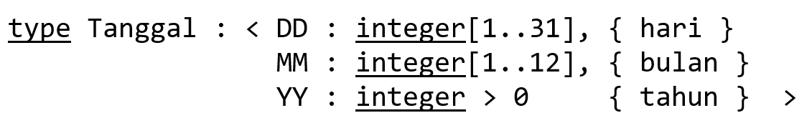

# Soal
## 1 
<p align="justify">
Tuliskan fungsi Max2 yang menerima masukan 2 buah bilangan real dan menghasilkan sebuah bilangan real, yaitu salah satu dari kedua bilangan tersebut yang terbesar.

Kemudian dengan menggunakan fungsi Max2, tuliskan fungsi lain Max3 yang menghasilkan nilai terbesar dari 3 buah bilangan real

**Contoh:** <br>
Max2 (1,2) → 2 <br>
Max2 (10,2) → 10 <br>
Max3 (1,2,3) → 3 <br>
Max3 (10,2,3) → 10
</p>

## 2
<p align="justify">
Didefinisikan type bentukan Tanggal untuk mewakili hari seperti pada kalender yang kita pakai sehari-hari



Contoh konstanta: < 5, 12, 2024> adalah 5 Desember 2024

Buatlah fungsi NextDay yang menerima masukan sebuah Tanggal dan menghasilkan tanggal keesokan harinya.

Contoh: <br>
NextDay(<13,4,2000>) → <14,4,2000> <br>
NextDay(<30,4,2024>) → <1,5,2024>
</p>

## 3
<p align="justify">
Buatlah prosedur Tukar yang menukar dua nilai integer yang tersimpan dalam dua buah nama, misalnya a dan b.

I.S. diberikan a = A dan b = B <br>
F.S. a = B dan b = A

Menggunakan prosedur Tukar, buatlah prosedur Putar3Bil yang digunakan untuk “memutar” 3 buah nama integer.

Contoh: Jika a = 1, b = 2, c = 3, maka a = 3, b = 1, c = 2
</p>

## 4
<p align="justify">
Buatlah program lengkap yang menerima masukan tanggal hari ini bertype Tanggal (lihat definisi type pada soal 2) dan menuliskan tanggal hari ini dan keesokan harinya ke layar.

Beberapa hal yang harus dilakukan:

Input data Tanggal harus dibuat dalam suatu prosedur bernama **BacaTanggal**. BacaTanggal yang menghasilkan sebuah tanggal yang valid (apa definisi tanggal valid?). Gunakan skema validasi dengan pengulangan (skema validasi II) untuk mendapatkan Tanggal valid. <br>
Buat fungsi **IsTanggalValid** yang menerima masukan 3 buah integer yang merepresentasikan masukan untuk hari, bulan, dan tahun dan menghasilkan true jika masukan hari, bulan, tahun dapat menghasilkan bulan valid. <br>
Menuliskan data Tanggal ke layar harus menggunakan sebuah prosedur bernama **TulisTanggal** yang menerima masukan bertype Tanggal dan menuliskan tanggal ke layar dalam bentuk \<hari> \<nama bulan> \<tahun>.
Contoh: Tanggal <13,4,2024> akan dicetak sebagai 13 April 2024. <br> 
Buatlah fungsi **NamaBulan** yang digunakan untuk mengkonversi bulan (integer[1..12]) menjadi nama bulan (string) dalam Bahasa Indonesia Januari, Februari, …, dst. <br>
Gunakan fungsi **NextDay** yang telah dibuat pada latihan soal 2 untuk mendapatkan keesokan hari suatu Tanggal.
</p>

## 5
Translasikan semua hasil latihan soal 1 s.d. 4 dalam Bahasa C.

## 6
<p align="justify">
Menggunakan skema pemrosesan sekuensial pada array, buatlah fungsi bernama HitungRerata yang menerima masukan sebuah TabInt T (lihat definisi pada slide 23), indeks efektif N (asumsikan N bernilai > 0, berarti TabInt T berisi minimum 1 elemen) dan menghasilkan nilai rata-rata elemen dalam T.
</p>

## 7
Adaptasikan prosedur untuk mencari nilai ekstrim pada slide 24, 26, dan 28 (materi Skema Standar Bag. 3) untuk mendapatkan nilai minimum dari elemen-elemen TabInt.

# Solusi
## 1
```
function Max2 (x : real, y : real) --> real
{ Menerima dua buah bilangan real dan mengeluarkan bilangan terbesar }

KAMUS LOKAL
ALGORITMA
     if x >= y then
          --> x
     else { x < y }
          --> y

function Max3 (x : real, y : real, z : real) --> real
{ Menerima tiga buah bilangan real dan mengeluarkan bilangan terbesar }

KAMUS LOKAL
     function Max2 ( x : real, y : real) --> real
     { Menerima dua buah bilangan real dan mengeluarkan bilangan terbesar }

ALGORITMA
     --> Max2(Max2(x, y), z)
```
## 2
```
function NextDay(t: Tanggal) --> Tanggal
{ Menerima sebuah tanggal dan mengeluarkan tanggal hari selanjutnya }

KAMUS LOKAL
function Kabisat(t: Tanggal) --> boolean
{ Mengembalikan true apabila tahun berupa kabisat }

ALGORITMA
     depend on (t.MM)
          t.MM ∈ {1, 3, 5, 7, 8, 10, 12}:
               depend on (t.DD, t.MM)
                    t.DD < 31: --> <t.DD+1, t.MM, t.YY>
                    t.DD = 31 and t.MM = 12: --> <1, 1, t.YY+1>
                    t.DD = 31: --> <1, t.MM+1, t.YY>
          t.MM = 2:
               depend on (t.DD, t.YY)
                    t.DD < 28: --> <t.DD+1, t.MM, t.YY>
                    t.DD = 28 and Kabisat(t.YY): --> <t.DD+1, t.MM, t.YY>
                    t.DD = 28: --> <1, t.MM+1, t.YY>
                    t.DD = 29: --> <1, t.MM+1, t.YY>
          t.MM ∈ {4, 6, 9, 11}
               depend on (t.DD)
                    t.DD < 30: --> <t.DD+1, t.MM, t.YY>
                    t.DD = 30: --> <1, t.MM+1, t.YY>
```

## 3
```
procedure Tukar (input/output a, b : integer) 
{ Mengambil dua integer dan menukar nilainya } 

{ I.S. a = A, b = B;     F.S. a = B, b = A }

KAMUS LOKAL 
     temp : integer 

ALGORITMA 
     temp <- a 
     a <- b 
     b <- temp 

procedure Putar3Bil (input/output a, b, c : integer) 
{ Mengambil 3 integer dan menggeser nilainya } 

{ I.S. a = A, b = B, c = C;     F.S. a = C, b = A, c = B }

KAMUS LOKAL 
     procedure Tukar (input/output a, b : integer) 
     { Mengambil dua integer dan menukar nilainya } 

ALGORITMA 
     Tukar(a, c) { a = C, b = B,  c = A } 
     Tukar(b, c) { a = C, b = A,  c = B }
```
## 4
```
Program Tanggal 
{ Menerima input tanggal, menampilkan tanggal dalam bahasa Indonesia, dan menampilkan tanggal selanjutnya } 

KAMUS 
     type Tanggal : <DD : integer[0..31], MM : integer[0..12], YY : integer > 0 > 
     t : Tanggal 
     procedure BacaTanggal(input/output t:Tanggal) 
     { Menerima input tanggal } 
     procedure TulisTanggal(input t:Tanggal) 
     { Menuliskan tanggal dalam bahasa indonesia } 
     function NextDay(t:Tanggal) --> Tanggal 
     { Menampilkan tanggal selanjutnya } 
ALGORITMA 
     BacaTanggal(t) 
     TulisTanggal(t) 
     t <-- NextDay(t) 

{ Realisasi Fungsi / Prosedur } 
procedure BacaTanggal(input/output: t) 
{ Menerima input tanggal } 
{ I.S. t tidak terdefinisi;     F.S. t terdefinisi dan valid }
KAMUS LOKAL 
     d, m, y : integer 
     function IsTanggalValid(d, m, y) --> boolean 
     { Mengecek validitas tanggal } 
ALGORITMA 
     iterate 
          input(d, m, y) 
     stop (IsTanggalValid(d, m, y)) 
          output("Tanggal tidak valid!") 
     t.DD <- d 
     t.MM <- m 
     t.YY <- y 


function IsTanggalValid(d, m, y) --> boolean 
{ Mengecek validitas tanggal } 
KAMUS LOKAL 
ALGORITMA 
     depend on (d, m, y) 
          m ∈ {1, 3, 5, 7, 8, 10, 12} and d <= 31: -> True 
          m ∈ {4, 6, 9, 11} and d <= 30: -> True 
          m = 2 and d <= 28: -> True 
          m = 2 and d = 29 and y % 4 = 0: -> True 
     else { tanggal tidak memenuhi semua syarat di atas } 
          -> False 


procedure TulisTanggal(input t:Tanggal) 
{ Menuliskan tanggal dalam bahasa indonesia } 
{ F.S. t ditampilkan ke layar }
KAMUS LOKAL 
ALGORITMA 
     output(t.DD, " ") 
     depend on t.MM 
          t.MM = 1: output("Januari ") 
          t.MM = 2: output("Februari ") 
          t.MM = 3: output("Maret ") 
          t.MM = 4: output("April ") 
          t.MM = 5: output("Mei ") 
          t.MM = 6: output("Juni ") 
          t.MM = 7: output("Juli ") 
          t.MM = 8: output("Agustus ") 
          t.MM = 9: output("September ") 
          t.MM = 10: output("Oktober ") 
          t.MM = 11: output("November ") 
          t.MM = 12: output("Desember ") 
     output(t.YY) 


function NextDay(t: Tanggal) --> Tanggal 
{ Menerima sebuah tanggal dan mengeluarkan tanggal hari selanjutnya } 

KAMUS LOKAL 
ALGORITMA 
     depend on (t.MM) 
          t.MM ∈ {1, 3, 5, 7, 8, 10, 12}: 
               depend on (t.DD, t.MM) 
                    t.DD < 31: --> <t.DD+1, t.MM, t.YY> 
                    t.DD = 31 and t.MM = 12: --> <1, 1, t.YY+1> 
                    t.DD = 31: --> <1, t.MM+1, t.YY> 
          t.MM = 2: 
               depend on (t.DD, t.YY) 
                    t.DD < 28: --> <t.DD+1, t.MM, t.YY> 
                    t.DD = 28 and t.YY % 4 = 0: --> <t.DD+1, t.MM, t.YY> 
                    t.DD = 28: --> <1, t.MM+1, t.YY> 
                    t.DD = 29: --> <1, t.MM+1, t.YY> 
          t.MM ∈ {4, 6, 9, 11} 
               depend on (t.DD) 
                    t.DD < 30: --> <t.DD+1, t.MM, t.YY> 
                    t.DD = 30: --> <1, t.MM+1, t.YY> 
 
```
## 5
```c
#include <stdio.h>

// Program Max2
// Menerima dua buah bilangan real dan mengeluarkan bilangan terbesar
float Max2(float a, float b){
    // KAMUS LOKAL
    // ALGORITMA
    if(a >= b){
        return a;
    }
    else{
        return b;
    }
}

// Program Max3
// Menerima dua buah bilangan real dan mengeluarkan bilangan terbesar
float Max3(float a, float b, float c){
    // KAMUS LOKAL
    // float Max2(float a, float b) -> float
    // ALGORITMA
    return Max2(Max2(a, b), c);
}

// Inisialisasi data type
typedef struct Date {
    int DD;
    int MM;
    int YY;
} Tanggal;
// Program NextDay
// Menerima sebuah tanggal dan mengeluarkan tanggal hari selanjutnya
Tanggal NextDay(Tanggal t){
    // KAMUS LOKAL
    // ALGORITMA
    if((t.MM + t.MM/8) % 2 == 1){
        if(t.DD < 31){ t.DD+=1; return t; }
        else if(t.DD == 31 && t.MM == 12){ t.DD = 1; t.MM = 1; t.YY += 1; return t;}
        else {t.DD = 1; t.MM += 1; return t;}
    }
    else if(t.MM == 2){
        if(t.DD < 28) { t.DD+=1; return t; }
        else if(t.DD == 28 && t.YY%4 == 0) { t.DD+=1; return t; }
        else {t.DD = 1; t.MM += 1; return t;}
    }
    else{
        if(t.DD < 30) { t.DD+=1; return t; }
        else {t.DD = 1; t.MM += 1; return t;}
    }
}

// Program TukarNilai
// Menerima dua integer kemudian menukar nilainya
// I.S. a = A, b = B; F.S. a = B, b = A 
void Tukar(int *a, int *b){
    // KAMUS LOKAL
    int temp;
    // ALGORITMA
    temp = *a;
    *a = *b;
    *b = temp;
}

// Program PutarNilai
// Menerima tiga integer kemudian menggeser nilainya
// I.S. a = C, b = A, c = B; F.S. a = C, b = A, c = B
void Putar(int *a, int *b, int *c){
    // KAMUS LOKAL
    // void Tukar(int a, int b)
    // ALGORITMA
    Tukar(a, c);
    Tukar(b, c);
}


// Program Penanggalan
// Menerima input tanggal, menampilkan tanggal dalam bahasa Indonesia, dan menampilkan tanggal selanjutnya
// KAMUS
void BacaTanggal(Tanggal *t);
void TulisTanggal(Tanggal t);
Tanggal NextDay(Tanggal t);
int main(){
    // KAMUS
    Tanggal t;
    // ALGORITMA
    BacaTanggal(&t);
    printf("Hari ini "); TulisTanggal(t);
    NextDay(t);
    printf("Besok "); TulisTanggal(t);
}


void BacaTanggal(Tanggal *t){
// { Menerima input tanggal }
// KAMUS LOKAL
    int d, m, y;
    int IsTanggalValid(int d, int m, int y);
    //  { Mengecek validitas tanggal }
// ALGORITMA
    for(;;){
        scanf("%d %d %d", &d, &m, &y);
        if(IsTanggalValid(d, m, y)) break;
        else printf("Tanggal tidak valid!\n");
    }
    *t = (Tanggal){d, m, y};
}

int IsTanggalValid(int d, int m, int y){
    // { Mengecek validitas tanggal }
    // KAMUS LOKAL
    // ALGORITMA
        if((m+m/8)%2 == 1 && d <= 31) return 1;
        else if((m == 4 || m == 6 || m == 9 || m == 11) && d <= 30) return 1;
        else if(m == 2 && d <= 28) return 1;      
        else if(m == 2 && d == 29 && y % 4 == 0) return 1;
        else return 0;
}

void TulisTanggal(Tanggal t){
// { Menuliskan tanggal dalam bahasa indonesia }
// I.S Tanggal t yang terdefinisi, F.S menampilkan tanggal t
// KAMUS LOKAL
// ALGORITMA
    printf("%d ", t.DD);
    if(t.MM == 1) printf("Januari ");
    else if(t.MM == 2) printf("Februari ");
    else if(t.MM == 3) printf("Maret ");
    else if(t.MM == 4) printf("April ");
    else if(t.MM == 5) printf("Mei ");
    else if(t.MM == 6) printf("Juni ");
    else if(t.MM == 7) printf("Juli ");
    else if(t.MM == 8) printf("Agustus ");
    else if(t.MM == 9) printf("September ");
    else if(t.MM == 10) printf("Oktober ");
    else if(t.MM == 11) printf("November ");
    else printf("Desember ");
    printf("%d\n", t.YY);
}
```

## 6
```
function HitungRerata(T : TabInt, N : integer) -> real
{ menghitung rata-rata dari elemen-elemen dalam T }
KAMUS LOKAL
     sum, count, i = integer
ALGORITMA
     count <- 0
     sum <- 0
     i traversal [1..N]
          sum <- sum + Ti
     count <- count + 1
     -> sum/count
```

## 7
```
procedure Min(input T : TabInt, N : integer, output Tmin : integer)
{ mencari nilai minimum dari tabel T }
{ I.S. Sebuah tabel T dengan ukuran N }
{ F.S. Mengeluarkan nilai minimum dari tabel T }
KAMUS LOKAL
     i = integer
ALGORITMA
     Tmin <- T1
     while(i <= N)
          if (Ti < Tmin) then
               Tmin <- Ti
          i <- i + 1
```