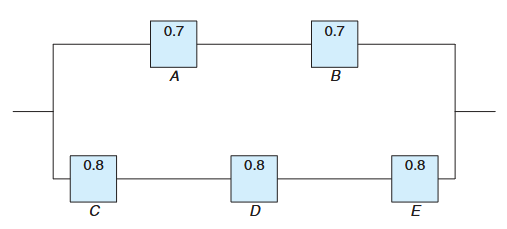
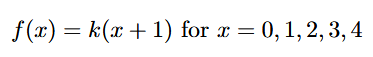
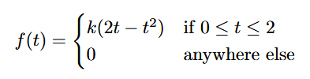
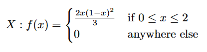

# Kuis 1 IF2120 - Probabilitas dan Statistika 2025/2026
### *(soal tidak 100% serupa dengan soal asli)*

1. Andy tidak diketahui golongan darahnya apa. Andy mempunyai golongan darah A dengan probability `50%`. Jika Andy tersebut bergolongan darah A, maka jika Andy menikah maka anaknya mempunyai kemungkinan tiap anak `50%` bergolongan darah A secara independen. Jika Andy tidak bergolongan darah A maka anaknya pasti tidak akan bergolongan darah A. Jika diketahui Andy mempunya 3 orang anak yaitu Teto, Miku, dan Neru ternyata ketiga-tiganya tidak bergolongan darah A, **berapa probabilitas Andy bergolongan darah A ?**

2. Dari sejumlah barang yang diproses dalam sebuah pabrik, terdapat `20%` peluang ditemukan sebuah barang yang cacat. Carilah probabilitas:
   1. Dari tiga barang yang diproses, ketiganya cacat semua.
   2. Dari empat barang yang diproses, ditemukan tiga barang yang cacat

3. Sistem kelistrikan terdiri dari empat komponen seperti yang diilustrasikan pada Gambar di bawah ini Sistem akan berfungsi jika komponen A dan B berfungsi, dan komponen C atau D berfungsi. Keandalan (probabilitas berfungsi) setiap komponen juga ditunjukkan pada Gambar di bawah ini.  
  
Tentukan probabilitas: 
   1. Seluruh sistem berfungsi.
   2. Komponen C tidak berfungsi, jika keseluruhan sistem berfungsi

4. Fungsi di bawah ini merupakan probabilitas ditemukannya X jumlah bug dalam sebuah program.   
  
Tentukan:
    1. Nilai k agar fungsi tersebut dapat menjadi distribusi probabilitas yang valid dari variabel acak diskrit X
    2. Probabilitas ditemukannya maksimum 2 bug dalam program.
    3. Rata-rata jumlah bug dalam program

5. Diketahui fungsi di bawah ini  
  
Tentukan: 
    1. Nilai k agar fungsi probabilitas valid
    2. CDF dari fungsi tersebut
    3. Probabilitas didapatkan `t > 1.5`

1. Keuntungan sebuah kafe dalam satuan 1 juta rupiah adalah variabel X yang memiliki fungsi kepadatan
  
Tentukan:
   1. Ekspektasi dan variansi keuntungan kafe tersebut
   2. Ekspektasi dan variansi keuntungan kafe tersebut pada bulan kedua jika keuntungan meningkat dengan mengikuti fungsi `g(x) = 2.5x + 1.2`
   3. Manajer yakin bahwa keuntungannya pasti melebihi 7.264 juta pada bulan kedua, buktikan keyakinan manajer tersebut benar atau salah