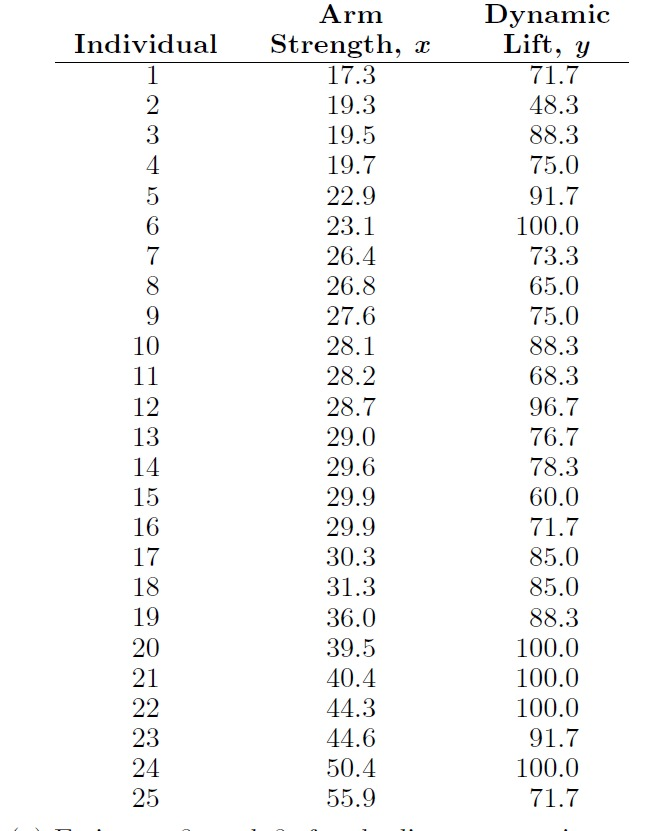
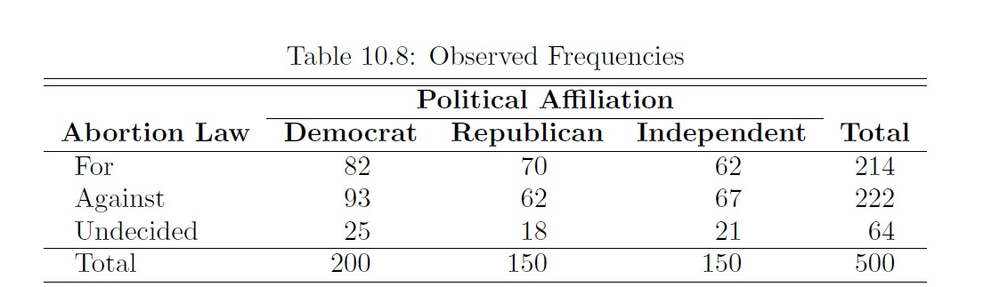
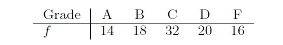

# UAS IF2120 - Probabilitas dan Statistika 2025/2026
### *(soal asli lebih banyak dari yang ada disini)*

1. A chemical engineer claims that the population mean yield of a certain batch process is `500 grams per milliliter` of raw material. To check this claim he samples `25 batches` each month. If the computed t-value falls between `-t₀.₀₅` and `t₀.₀₅`, he is satisfied with this claim. What conclusion should he draw from a sample that has a mean `x̄ = 518 grams per milliliter` and a sample standard deviation `s = 40 grams`? Assume the distribution of yields to be approximately normal. 

2. A group of human factor researchers are concerned about reaction to a stimulus by airplane pilots in a certain cockpit arrangement. An experiment was conducted in a simulation laboratory, and `15 pilots`
were used with average reaction time of `3.2 seconds` with a sample standard deviation of `0.6 second`. It is of interest to characterize the extreme (i.e., worst case
scenario). To that end, do the following:   
Give a particular important `one-sided 99% confidence bound` on the mean reaction time. What assumption, if any, must you make on the distribution of reaction times?

3. A new rocket-launching system is being considered for deployment of small, short-range rockets. The
existing system has `p = 0.8` as the probability of a successful launch. A sample of `40 experimental launches`
is made with the new system, and `34 are successful`.
   1. Construct a `95% confidence interval` for p.
   2. Would you conclude that the new system is better?

4. Perhatikan data berikut:  
     
   Tuliskan persamaan linear regression nya pakai **least square estimation**.  
   Hitunglah **R (koefisien determinasi)** dan **r (koefisien korelasi)** sampel

5. A random sample of 20 students yielded a mean of `x̄ = 72` and a variance of `s2 = 16` for scores on a
college placement test in mathematics. Assuming the scores to be normally distributed, construct a `98% confidence interval for σ2`

6. Suppose, for example, that we decide in advance to select `200 Democrats`, `150 Republicans`, and `150 Independents` from the voters of the state of North Carolina and record whether they are for a proposed abortion law, against it, or undecided.
The observed responses are given in  
  
Identify whether the three categories of voters are **homogeneous** with respect to their opinions concerning the proposed abortion law.

7. The grades in a statistics course for a particular semester were as follows:  
  
Test the hypothesis, at the `0.05 level of significance`, that the distribution of grades is **uniform**

8. A manufacturer of sports equipment has developed a new synthetic fishing line that the company claims has a mean breaking strength of `8 kilograms` with a standard leviation of `0.5 kilogram`. Test the hypothesis that `µ = 8 kilograms` against the alternative that `µ ≠ 8 kilograms` if a random sample of `50 lines` is tested and found to have a mean breaking strength of `7.8 kilograms`. Use a `0.01 level of significance`. 